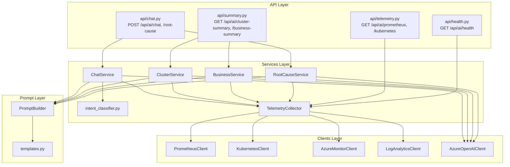

# CredAI Service - Architecture

This document describes the actual implementation - concrete modules,
not just concepts. For the higher-level design rationale (why AIOps,
why these use cases), see `observability/aiops/01-AIOps-Architecture.md`.

## Component diagram

## Layer responsibilities

- **API layer** (`app/api/`) - FastAPI route handlers only. Validates
  request shape (via Pydantic), calls exactly one service method,
  translates known errors (`OpenAIClientError`, `PrometheusClientError`)
  into HTTP status codes. No business logic lives here.
- **Services layer** (`app/services/`) - Orchestration. Each service
  (`ChatService`, `ClusterService`, `BusinessService`,
  `RootCauseService`) implements the same four-step pattern: gather
  facts → build prompt → call the LLM → shape the response. The
  `TelemetryCollector` is the single owner of all four client
  instances; no other module constructs a client directly.
- **Clients layer** (`app/clients/`) - One class per external system
  (Prometheus, Kubernetes, Azure Monitor, Log Analytics, Azure OpenAI).
  Each is isolated - none imports or knows about any other client. Each
  returns normalized facts (or, for the LLM client, raw text) - never a
  provider-specific object leaking into the services layer.
- **Prompt layer** (`app/prompt_builder/`) - Turns normalized facts
  into the actual text sent to the LLM. Never queries telemetry itself.
- **Models** (`app/models/schemas.py`) - Every request/response shape,
  independent of internal data shapes.
- **Config** (`app/config/settings.py`) - The only place environment
  variables are read.

## Graceful degradation

Every client except Prometheus and Azure OpenAI is **optional**:

| Client | Behavior when not configured |
|---|---|
| `KubernetesClient` | `is_configured` is `False`; every method returns `[]` instead of raising (e.g. running outside a cluster, for local dev) |
| `AzureMonitorClient` | `is_configured` is `False` when no Service Principal credential is set; methods return `[]` / `{"available": None}` |
| `LogAnalyticsClient` | Same pattern - `is_configured` requires both a credential and `LOG_ANALYTICS_WORKSPACE_ID` |
| `PrometheusClient` | **Required** - if unreachable, the specific request fails with a clear error rather than a silent empty result, since Prometheus is this service's primary data source |
| `AzureOpenAIClient` | **Required** - if not configured, chat/summary endpoints return `503`, but `/api/ai/prometheus` and `/api/ai/kubernetes` (no LLM involved) keep working |

This mirrors exactly how the Data Contract
(`observability/aiops/architecture/01-Observability-Data-Contract.md`)
already distinguishes "always available" sources from optional ones -
the code's degradation behavior is not arbitrary, it follows that
document's classification.

## Isolation guarantee

No client module imports another client module. `grep -r "from app.clients" app/clients/`
returns nothing - this is enforced by code review convention, not a
lint rule, but it is easy to verify: each client file only imports from
`app.config` and `app.utils`, never from a sibling client.
