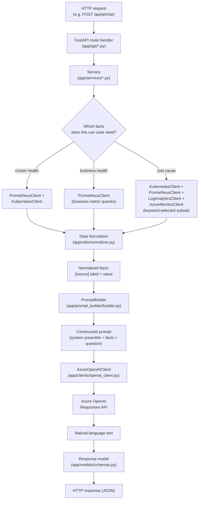
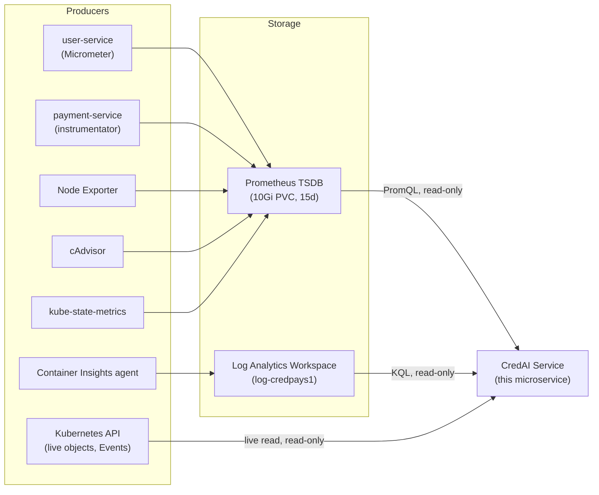
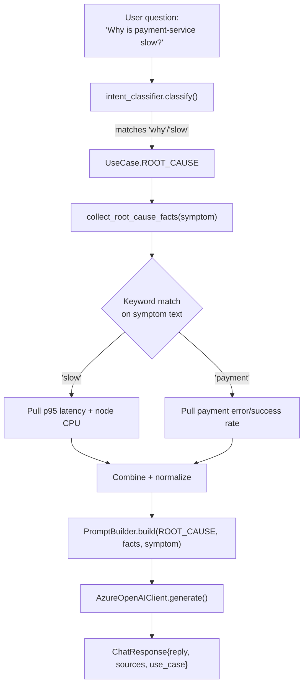

# CredAI Service - Data Flow

## End-to-end flow (any use case)

## Where each dataset is produced and stored (unchanged from before CredAI existed)

**Key point:** CredAI adds a new arrow *out of* each existing store
(Prometheus TSDB, the Log Analytics Workspace, the Kubernetes API) - it
adds zero new arrows *into* any of them. Nothing about how telemetry is
produced or stored changed when this service was added.

## Chat request flow, with intent classification

