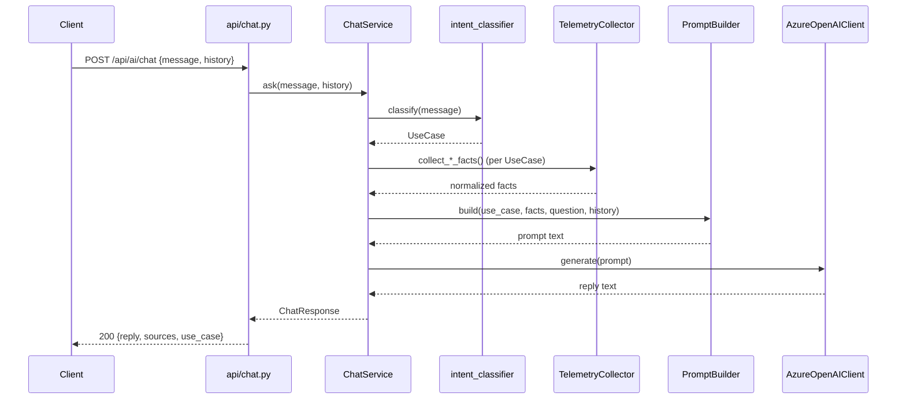
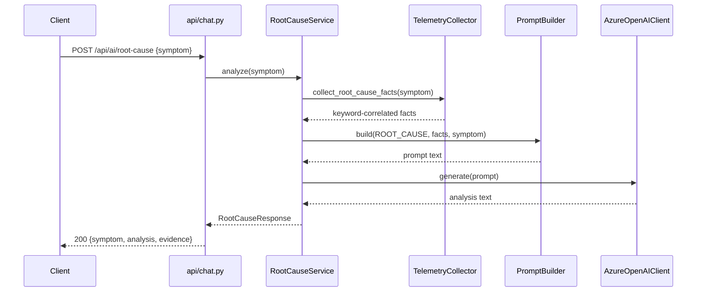
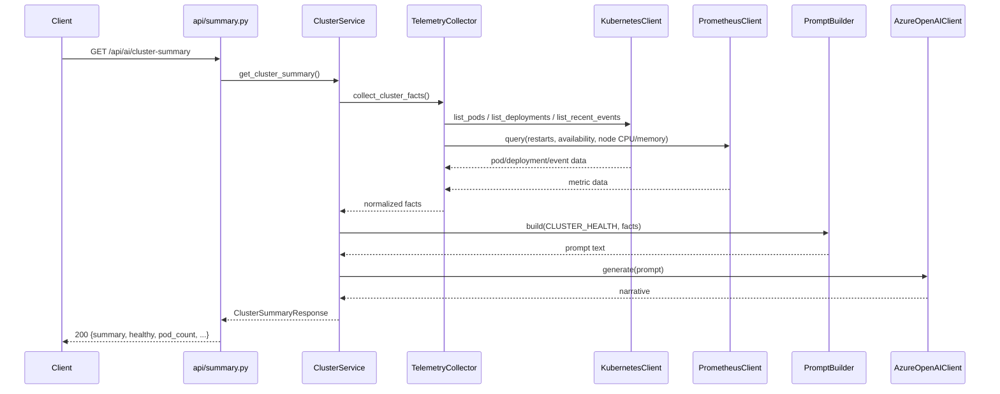
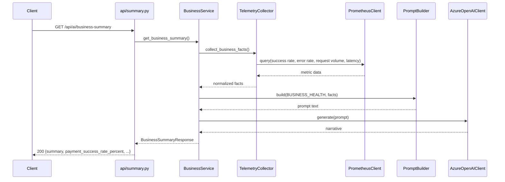
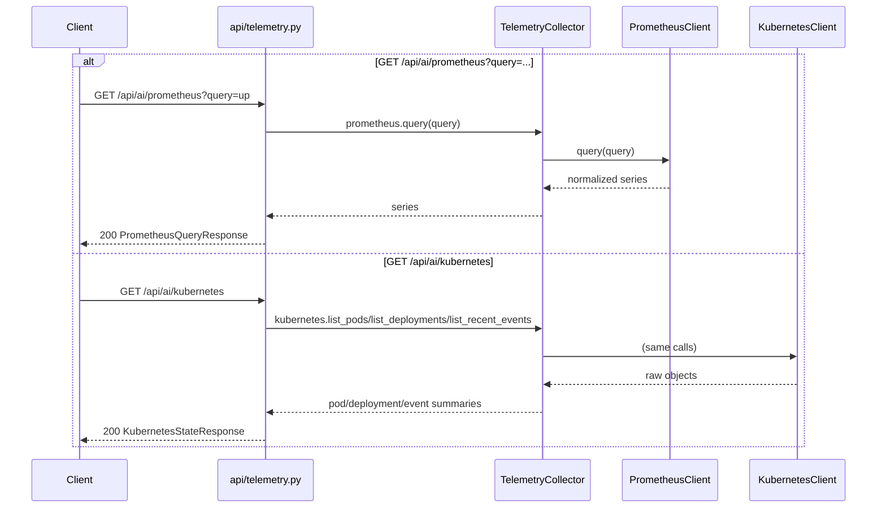
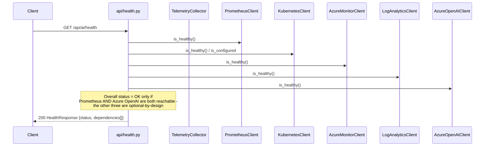

# CredAI Service - Sequence Diagrams

One diagram per endpoint, matching the actual code in `app/api/` and
`app/services/` exactly.

## POST /api/ai/chat

## POST /api/ai/root-cause

## GET /api/ai/cluster-summary

## GET /api/ai/business-summary

## GET /api/ai/prometheus and GET /api/ai/kubernetes (no LLM involved)

## GET /api/ai/health

