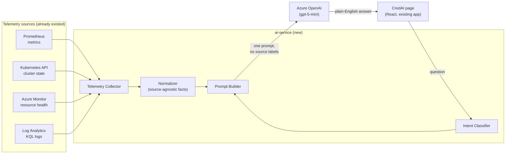
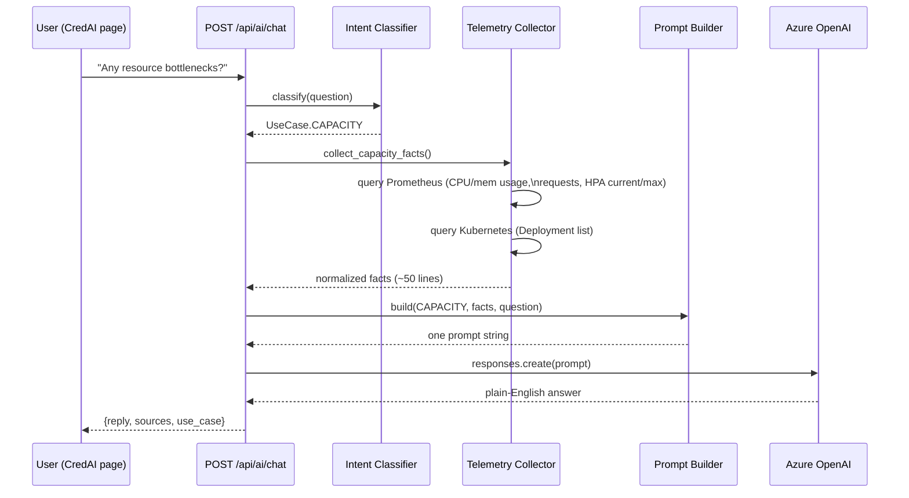

# From Prometheus to AI Service: How CredAI Turns Telemetry Into Answers

**Audience:** students following this capstone. This is the single document
that ties the whole observability → AIOps story together — what we built,
why we built it that way, and every real mistake we made along the way.
Read this first; then go deeper into `ai-service/docs/` and
`observability/aiops/01-AIOps-Architecture.md` for implementation-level
detail.

---

## Table of contents

1. [The problem this solves](#1-the-problem-this-solves)
2. [The big picture](#2-the-big-picture)
3. [What is AIOps, really](#3-what-is-aiops-really)
4. [The four telemetry sources](#4-the-four-telemetry-sources)
5. [How a question becomes an answer](#5-how-a-question-becomes-an-answer)
6. [The build process, phase by phase](#6-the-build-process-phase-by-phase)
7. [What we learned (real bugs, real fixes)](#7-what-we-learned-real-bugs-real-fixes)
8. [Azure resources this platform runs on](#8-azure-resources-this-platform-runs-on)
9. [Kubernetes resources this platform runs on](#9-kubernetes-resources-this-platform-runs-on)
10. [Glossary](#10-glossary)
11. [Where to go next](#11-where-to-go-next)

---

## 1. The problem this solves

CredPay already had observability *tools*: Prometheus scraping metrics,
Grafana drawing dashboards, Kubernetes exposing cluster state, Azure
tracking resource health. What it didn't have was a way for a human to ask
a plain-English question — **"why is payment-service slow?"** — and get a
plain-English answer, without first knowing PromQL, which dashboard to
open, or which of four different systems holds the relevant fact.

**CredAI** is a FastAPI microservice that sits between those existing
telemetry systems and an LLM (Azure OpenAI). It doesn't replace Prometheus
or Grafana — it reads from them, the same way a human operator would, and
turns what it reads into a conversation.

The one rule that shaped every design decision below: **the LLM never
touches raw telemetry, and never knows which system a fact came from.**
Every number is fetched, normalized into a plain `[source] label = value`
line, and only then handed to the model as part of a prompt it was built
to answer. This keeps the model's job simple (summarize what it's given)
and keeps every telemetry integration swappable without touching a single
prompt.

## 2. The big picture

Two things worth noticing in this diagram:

- **Azure Monitor and Log Analytics are optional.** They require a Service
  Principal (`AZURE_TENANT_ID` / `AZURE_CLIENT_ID` / `AZURE_CLIENT_SECRET`)
  that this deployment never configured. The service degrades gracefully —
  those two clients report `not_configured` and simply contribute nothing,
  rather than breaking the whole answer. Prometheus and Kubernetes are the
  two sources that are always live in this project.
- **The Normalizer is the architectural chokepoint.** Every fact, no matter
  the source, becomes the same shape before the Prompt Builder ever sees
  it. This is what makes the "LLM never knows the source" rule actually
  enforceable in code, not just a comment.

## 3. What is AIOps, really

"AIOps" (AI for IT Operations) is an industry term for using
machine-learning/LLM techniques on top of the operational data a platform
already produces — metrics, logs, traces, events — to do things a human
operator does manually: summarize health, spot anomalies, correlate
symptoms with root causes, and answer "what's going on right now."

It is **not** a replacement for Prometheus/Grafana/alerting. It's a
conversational layer *on top of* them. CredAI never invents its own
metrics pipeline — it is a consumer of the exact same data an engineer
would otherwise pull up in a dashboard, just aggregated and explained in
one response instead of across five browser tabs.

The specific AIOps pattern used here is sometimes called **RAG for
operations** (Retrieval-Augmented Generation): retrieve the relevant facts
first (from Prometheus/Kubernetes/Azure), then hand them to the LLM as
grounding context, and instruct it — in the system prompt — to answer only
from what it was given rather than from its own general training data.
That single design choice is why CredAI can answer "how many pods restarted
today?" correctly instead of confidently making up a number.

## 4. The four telemetry sources

| Source | What it provides | Client | Required? |
|---|---|---|---|
| **Prometheus** | Time-series metrics: pod restarts, deployment availability, node CPU/memory, per-pod CPU/memory usage vs configured requests, HPA replica counts, HTTP success/error rates, latency | `app/clients/prometheus_client.py` | **Yes** — health reports `degraded` without it |
| **Kubernetes API** | Live cluster state: current Pod phases, Deployment replica counts, recent Events (the *right now* view, independent of whatever Prometheus last scraped) | `app/clients/kubernetes_client.py` | No — degrades to empty results if not running in-cluster or RBAC is missing |
| **Azure Monitor** | AKS resource health (is the *platform itself* — not just the app — healthy) | `app/clients/azure_monitor_client.py` | No — needs a Service Principal; not configured in this deployment |
| **Log Analytics** | KQL queries over container logs / Kubernetes events with longer retention than Prometheus | `app/clients/log_analytics_client.py` | No — same Service Principal requirement |

Every client returns a `list[dict]` in the exact same shape:
`{"source": ..., "label": ..., "value": ...}`. A Prometheus fact and a
Kubernetes fact are indistinguishable in shape by the time the Prompt
Builder sees them — only the `source` string differs, and even that is
stripped from what the LLM reads (see [§7.7](#77-ambiguous-fact-labels-the-llm-couldnt-tell-cpu-from-memory)
for what happens when you get this normalization wrong).

## 5. How a question becomes an answer

The **Intent Classifier** (`app/services/intent_classifier.py`) is
deliberately simple: ordered keyword matching, not a model. A question
containing "bottleneck" or "highest cpu" routes to `CAPACITY`; "why" or
"slow" routes to `ROOT_CAUSE`; nothing else matches routes to
`GENERAL_CHAT` with a broad snapshot. This is intentional for a v1 — it's
transparent, debuggable in five minutes by reading one file, and its
failure mode is graceful (a broad answer, never a refusal).

## 6. The build process, phase by phase

The platform was built in five explicit phases, in this order, each one
depending only on what came before it:

1. **Architecture first.** Before any code: a folder structure, a data
   flow diagram, a sequence diagram, an API contract — written down so
   every later phase had something to build against
   (`ai-service/docs/`, `observability/aiops/01-AIOps-Architecture.md`).
2. **The FastAPI skeleton.** Config, models, logging, health endpoint,
   error handling — a service that runs and answers `/api/ai/health`
   before it can answer anything intelligent.
3. **Telemetry clients, one per source**, each isolated from the others
   and each returning normalized facts — built and tested independently
   (including a real `kubectl port-forward` to the live Prometheus to
   prove the PromQL actually returns real numbers, not just parses).
4. **The Prompt Builder and LLM Connector** — turning normalized facts
   into one prompt per use case, and one client that knows how to call
   Azure OpenAI's Responses API.
5. **The frontend** — a new page in the *existing* React app (not a new
   app), a new nav entry, a ChatGPT-style chat UI with Quick Actions and
   Suggested Questions.

Only after all five phases were code-complete did the platform get
**actually deployed** to the live AKS cluster — and that's where most of
[§7](#7-what-we-learned-real-bugs-real-fixes) happened.

## 7. What we learned (real bugs, real fixes)

This is the most valuable section for a student to read carefully. Every
one of these was a genuine failure hit against the real, live system —
not a hypothetical. Each follows the same shape: **what broke → why → how
we found it → the fix.**

### 7.1 "It compiles" is not "it's deployed"

**What broke:** the frontend had the CredAI page, a passing `npm run
build`, and a clean browser test — and the live app still showed no
CredAI nav item at all.
**Why:** the running `frontend-blue` pod was serving a Docker image built
*before* the CredAI code existed. Nobody had rebuilt and pushed a new
image after the last code change.
**How we found it:** `kubectl exec` into the live pod and `grep -ril
credai /usr/share/nginx/html/` came back empty — direct proof the deployed
bundle didn't contain the new code, even though the local build did.
**Fix:** `docker build` → `docker push` → `kubectl rollout restart
deployment/frontend-blue`. **Lesson:** a green local build tells you the
code is correct. It tells you nothing about what's actually running in
the cluster. Always verify the artifact that's live, not the one on your
laptop.

### 7.2 The Azure OpenAI endpoint already included the path the SDK adds itself

**What broke:** every chat request returned "CredAI could not respond."
**Why:** the Azure AI Foundry portal shows an endpoint URL ending in
`/openai/v1/responses`. The OpenAI Python SDK's `client.responses.create()`
appends `/responses` to whatever `base_url` you give it. Passing the full
portal URL as `base_url` produced a request to
`.../openai/v1/responses/responses` — doubled, and a 404.
**Fix:** strip a trailing `/responses` from the configured endpoint before
handing it to the SDK (`app/config/settings.py`, a `field_validator`).
**Lesson:** an endpoint a cloud portal shows you is not automatically the
`base_url` an SDK expects — check what the SDK appends before assuming.

### 7.3 The pinned SDK version predated the API being called

**What broke:** `AttributeError: 'OpenAI' object has no attribute
'responses'`.
**Why:** `requirements.txt` had `openai==1.54.4` (Nov 2024). The Responses
API (`client.responses.create`) was added to the SDK later than that.
**How we found it:** ran a throwaway `docker run python:3.14-slim` with a
newer version installed and checked `hasattr(client, 'responses')` before
touching the real deployment.
**Fix:** bumped to `openai==1.109.1`, verified first, then rebuilt.
**Lesson:** pinning exact versions is good practice, but pin *after*
confirming the feature you need actually exists in that version.

### 7.4 The `/v1` endpoint shape rejects a parameter the older shape requires

**What broke:** `400 Bad Request: api-version query parameter is not
allowed when using /v1 path`.
**Why:** Azure OpenAI has two different endpoint shapes —
`/openai/deployments/<name>/chat/completions?api-version=...` (the older
one, which *requires* `api-version`) and `/openai/v1/...` (newer,
self-versioning, which *rejects* it). The client code was passing
`api-version` as a query param unconditionally, copied from older Azure
OpenAI examples that target the first shape.
**Fix:** removed `default_query={"api-version": ...}` entirely from the
client — the `/v1` shape doesn't want it. **Lesson:** Azure OpenAI's two
endpoint shapes are not interchangeable and their examples don't mix;
know which one your `base_url` actually points at.

### 7.5 The "deployment name" wasn't a deployment name

**What broke:** `404 DeploymentNotFound`, even after fixing 7.2–7.4.
**Why:** the endpoint URL's path segment `/api/projects/<X>/...` is the
Azure AI Foundry **project** name — a different thing from the **model
deployment name** (the name you gave the model when you deployed it,
e.g. `gpt-5-mini`). It's an easy mix-up because both are just short
strings that appear near each other in the portal.
**How we found it:** `az cognitiveservices account deployment list
--name <resource> --resource-group <rg>` — asked Azure directly what
deployment names actually exist under that resource, rather than trusting
what looked right.
**Fix:** used the real deployment name from that command's output.
**Lesson:** when an API says "not found" for something you're sure you
typed correctly, ask the *source of truth* (here, the Azure CLI) what it
actually has — don't just re-read the string more carefully.

### 7.6 A reasoning model can spend its whole token budget thinking

**What broke:** responses were empty (`Azure OpenAI returned an empty or
unrecognized response`) once the prompts got longer and more detailed
(the capacity-planning prompt in particular).
**Why:** `gpt-5-mini` is a *reasoning* model — before producing visible
output text, it spends some of its `max_output_tokens` budget on internal
reasoning tokens the API never shows you. A short budget on a complex
prompt can be consumed entirely by reasoning, leaving zero tokens for the
actual answer.
**Fix:** two changes together — set `reasoning={"effort": "low"}` (a real
parameter on the Responses API, confirmed via `inspect.signature` before
using it) so less budget goes to hidden reasoning, and raised
`max_output_tokens` from 800 → 2000 → 3500 as the prompts grew richer.
**Lesson:** with reasoning models, "the response is empty" doesn't always
mean something is broken — it can mean the model ran out of room to
*answer* after it finished *thinking*.

### 7.7 Ambiguous fact labels: the LLM couldn't tell CPU from memory

**What broke:** asking "any resource bottlenecks?" produced a vague answer
citing raw numbers like `instance=10.0.0.63 = 41.72` with no indication of
what that number even was.
**Why:** the Normalizer built each fact's label purely from the
Prometheus metric's own labels (e.g. `instance=10.0.0.63`), and
deliberately excluded Prometheus's `__name__` field. Two completely
different PromQL queries (node CPU % vs node memory %) could produce
facts that looked identical except for the number itself.
**Fix:** every call site now passes a human-readable `metric_name` (e.g.
`"Node available memory %"`) alongside the query, threaded through
`normalize_prometheus_result()` into the label the LLM actually reads.
**Lesson:** "the LLM should never know which system a fact came from" (an
intentional design rule, §1) is not the same as "the LLM doesn't need to
know *what* a fact measures." Source-anonymity and metric-clarity are two
different things — losing the second one to protect the first produces
answers that sound confident and mean nothing.

### 7.8 One query hid the exact data the feature needed

**What broke:** a capacity-planning answer that only ever mentioned one
pod, no matter how many pods existed.
**Why:** the PromQL query behind it was
`topk(1, sum(rate(container_cpu_usage...)) by (pod))` — `topk(1, ...)`
*by design* returns only the single highest result. It was originally
written to answer "which deployment has the highest CPU?", then reused
for general capacity planning without noticing the built-in filter.
**Fix:** added a separate, unfiltered `by (pod)` query returning every
pod's usage, plus new queries for configured CPU/memory *requests*
(`kube_pod_container_resource_requests`) and HPA current/max replicas —
so the model could compare *usage vs. what was actually provisioned*,
which is what "over/under-provisioned" requires. **Lesson:** a query that
correctly answers one question can silently be the wrong query for a
different one that reuses it — re-derive what a query actually returns,
don't assume it generalizes.

### 7.9 A health check asked for a permission it was never granted — on purpose

**What broke:** `GET /api/ai/health` reported Kubernetes as `unavailable`,
even though the real Kubernetes calls (`list_pods`, `list_deployments`)
were working correctly and had been the whole time.
**Why:** the health probe called `list_namespace()` — a **cluster-scoped**
operation — but `credai-service`'s RBAC is a deliberately least-privilege,
**namespaced** `Role` scoped only to the `credpay` namespace (see
[§9](#9-kubernetes-resources-this-platform-runs-on)). The probe was
checking a permission the design intentionally never grants.
**Fix:** changed the probe to `list_namespaced_pod(namespace=...)` — the
same *kind* of permission the RBAC Role actually has.
**Lesson:** a health check should exercise the same permission surface the
feature actually uses. A probe that checks for more access than the
service is supposed to have will fail even when everything is working
exactly as designed.

## 8. Azure resources this platform runs on

| Resource | Name (this deployment) | Purpose |
|---|---|---|
| Resource Group (app infra) | `rg-credpays1` | Holds the Terraform-managed application infrastructure |
| Resource Group (bootstrap) | `CredPayRG` | Holds resources created once, out-of-band, before Terraform ever runs |
| AKS cluster | `aks-credpays1` | Runs every Pod in this project — frontend, user-service, payment-service, ai-service, and the whole monitoring stack |
| Virtual Network | `vnet-credpays1` | Network isolation for the cluster and PostgreSQL |
| PostgreSQL Flexible Server | `psql-credpays1` | The application's relational database (users, cards, payments) |
| Log Analytics Workspace | `log-credpays1` | Backs Container Insights; would also back the optional Log Analytics AIOps client if a Service Principal were configured |
| Container Insights | `ContainerInsights(log-credpays1)` | AKS's built-in monitoring solution, separate from (and complementary to) the self-hosted Prometheus/Grafana stack |
| Azure Container Registry | `credpayacrs1` | Stores every Docker image (frontend, user-service, payment-service, **ai-service**) |
| Azure Key Vault | `credpaykvs1` | Stores the PostgreSQL password Terraform generates; the pipeline reads it back at deploy time |
| Storage Account | `credpaysas1` | Terraform's own remote state backend |
| Azure AI Foundry account | `bharathreddy3297-0332-resource` | The Cognitive Services resource hosting the LLM |
| Azure AI Foundry project | `bharathreddy3297-0332` | A project under that account (this is the string that gets confused with the deployment name — see [§7.5](#75-the-deployment-name-wasnt-a-deployment-name)) |
| Model deployment | `gpt-5-mini` | The actual deployed model CredAI calls — this exact string is `OPENAI_DEPLOYMENT` |

Every one of these except the AI Foundry resources is provisioned by
`terraform/` (see `terraform/modules/`). The AI Foundry account, project,
and model deployment were created directly in the Azure AI Foundry portal
and are **not** Terraform-managed in this project.

## 9. Kubernetes resources this platform runs on

**`monitoring` namespace** (created by `observability/prometheus/01-prometheus-server/prometheus.yaml` itself):

| Resource | Kind | Purpose |
|---|---|---|
| `prometheus` | Deployment + ServiceAccount + ClusterRole/Binding + Service | Scrapes and stores every metric in this platform |
| `node-exporter` | DaemonSet + Service | One Pod per node, exposes node-level CPU/memory/disk metrics |
| `kube-state-metrics` | Deployment + Service | Exposes Kubernetes object state (Pod phase, Deployment replicas, HPA status, resource requests/limits) as Prometheus metrics |
| `grafana` | Deployment + Service + provisioned datasource | Dashboards on top of Prometheus — six pre-built (`observability/grafana/03-dashboards/`) |

**`credpay` namespace** (the application namespace — ai-service adds these five resources to what was already there):

| Resource | Kind | Purpose |
|---|---|---|
| `credai-service` | ServiceAccount + namespaced Role + RoleBinding | Least-privilege: `get/list/watch` on `pods`, `events`, and `apps/deployments` — nothing else, and nothing cluster-scoped (see [§7.9](#79-a-health-check-asked-for-a-permission-it-was-never-granted--on-purpose)) |
| `credai-config` | ConfigMap | Non-secret settings (Prometheus URL, namespace, CORS) |
| `credai-secrets` | Secret | `OPENAI_ENDPOINT` / `OPENAI_KEY` / `OPENAI_DEPLOYMENT` / `OPENAI_API_VERSION` — created out-of-band, never committed (see the companion step-by-step guide for exactly how) |
| `credai-service` | Deployment | 1 replica, `100m`/`128Mi` requests, `400m`/`384Mi` limits, `maxSurge:0`/`maxUnavailable:1` — deliberately conservative; this cluster has hit capacity limits before |
| `credai-service` | Service + HPA (1–3 replicas, 75% CPU target) | Internal ClusterIP + autoscaling |
| `credai-service` | Ingress | A separate `Ingress` object, `/api/ai` path — merges with the existing Ingress via ingress-nginx's multi-resource support; the original `k8s/ingress/ingress.yaml` was never edited |

## 10. Glossary

- **PromQL** — Prometheus's query language; every metric in this platform is read through it.
- **Normalized fact** — the `{"source", "label", "value"}` shape every telemetry client returns, regardless of origin.
- **Intent classification** — deciding which prompt template and which telemetry to fetch for a given question.
- **RAG (Retrieval-Augmented Generation)** — fetch real data first, then ask the LLM to reason only over that data.
- **Responses API** — Azure OpenAI / OpenAI's newer request shape (`client.responses.create`), distinct from the older `chat.completions.create`.
- **Reasoning effort** — how much of a reasoning model's token budget it spends "thinking" before answering; lower effort leaves more room for visible output.
- **Least privilege** — granting a service exactly the permissions it uses, no more (see `credai-service`'s namespaced Role).
- **Blue/green deployment** — running two copies of the frontend, only one live at a time, so a bad release never reaches real traffic (see `k8s/frontend/`).

## 11. Where to go next

- **Implementation depth:** `ai-service/docs/Architecture.md`,
  `ai-service/docs/DataFlow.md`, `ai-service/docs/SequenceDiagram.md`,
  `ai-service/docs/API-Documentation.md`.
- **The original architecture spec:** `observability/aiops/01-AIOps-Architecture.md`
  and `observability/aiops/architecture/01-Observability-Data-Contract.md`.
- **Hands-on deployment, from an empty cluster:** the companion document,
  `observability/STEP-BY-STEP-DEPLOYMENT-GUIDE.md` — every command needed
  to stand up Prometheus → Grafana → CredAI using `kubectl` only, including
  how to create and rotate the Azure OpenAI credentials.
- **Prometheus fundamentals:** `observability/prometheus/cheatsheets/`.
- **Grafana walkthrough:** `observability/grafana/documentation/install-and-dashboard-guide.md`.
