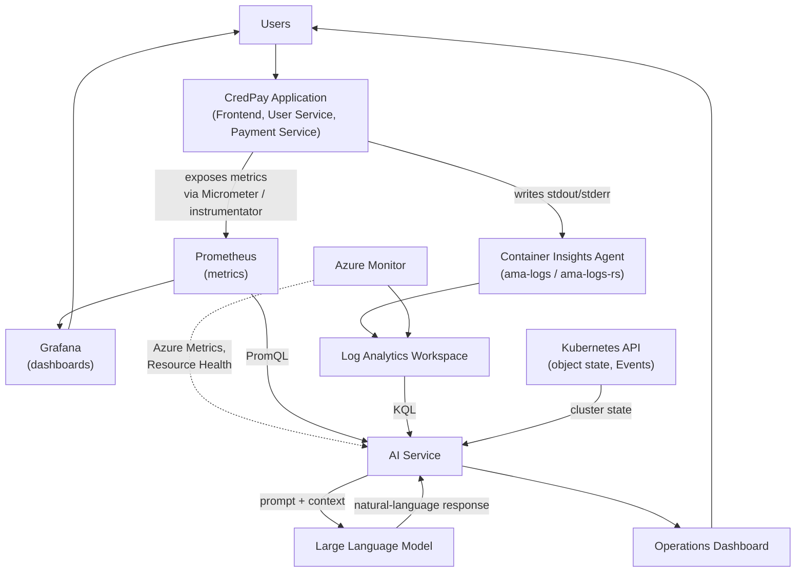
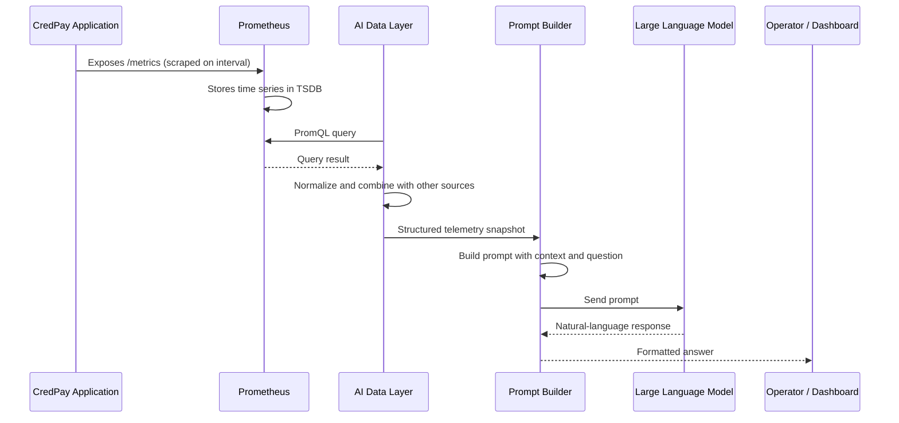
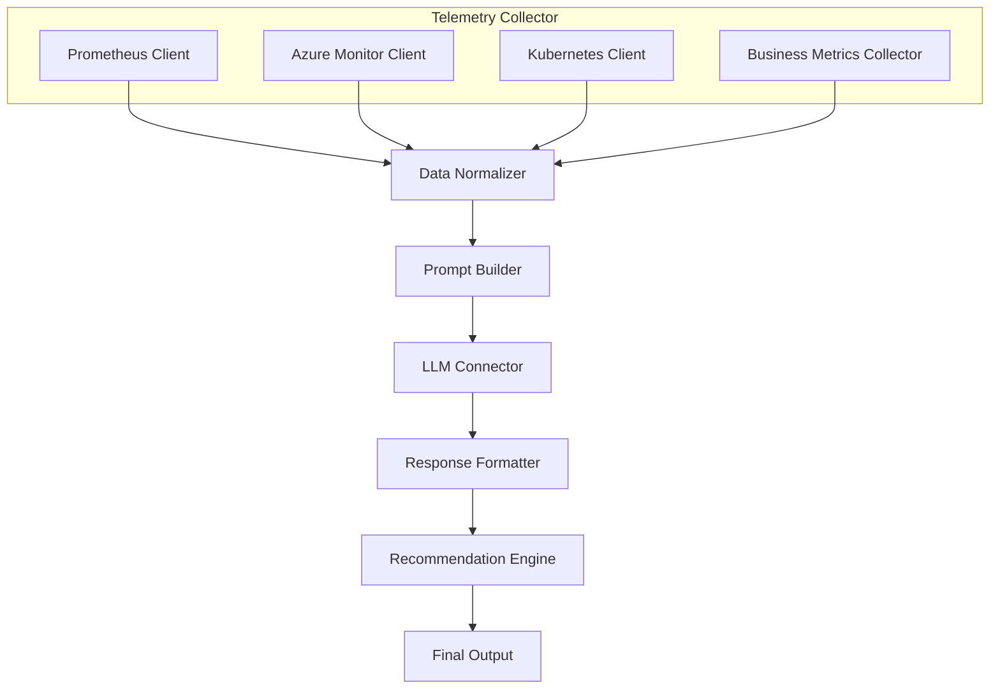
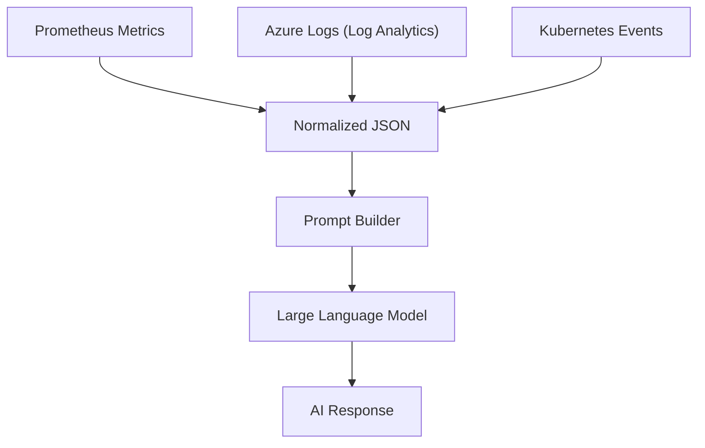

# CredPay AIOps - Solution Architecture

**Document type:** Enterprise solution architecture document.

**Status:** Architecture and design only. No AI service, API, or
automation is implemented in this document. Every telemetry source
referenced here is drawn directly from
`observability/aiops/architecture/01-Observability-Data-Contract.md` -
nothing is assumed beyond what that document already verified exists.

**Audience:** This document is written to be usable for classroom
teaching, architecture review, interview preparation, and as living
GitHub documentation - no prior AIOps experience is assumed.

---

## Table of Contents

| Chapter | Title |
|---|---|
| 1 | Introduction |
| 2 | Overall Architecture |
| 3 | Telemetry Sources |
| 4 | Data Flow |
| 5 | AI Service Architecture |
| 6 | Supported AI Use Cases |
| 7 | Data Sources vs. AI Capability Matrix |
| 8 | Prompt Flow |
| 9 | Future Expansion |
| 10 | Architecture Summary |

---

# Chapter 1 - Introduction

## What is AIOps

AIOps (Artificial Intelligence for IT Operations) is the practice of
using AI - typically a Large Language Model (LLM) reasoning over
telemetry data - to help operate a system: summarizing its health,
explaining incidents, and surfacing insights a human would otherwise
have to piece together manually from dashboards, logs, and metrics.

AIOps does not replace observability. It *sits on top of* an existing
observability platform and reasons over the data that platform already
collects. CredPay's AIOps layer, as designed in this document, consumes
exactly the telemetry already documented in the Data Contract - it adds
a reasoning layer, not a new data-collection layer.

## Why AIOps

CredPay's observability platform (Prometheus, Grafana, Azure Monitor,
Log Analytics) already answers *specific* questions well - "what is
this metric's value right now," "show me this dashboard." What it
does not do is **synthesize** across many data sources into a single,
plain-language answer to a broader question - "is CredPay healthy right
now, and if not, why?" Answering that today requires a human to open
several dashboards, run several queries, and mentally combine the
results. AIOps exists to do that synthesis automatically.

## Difference between Monitoring and AIOps

| | Monitoring (already built) | AIOps (this document's subject) |
|---|---|---|
| **What it does** | Collects, stores, and displays telemetry | Reasons over already-collected telemetry |
| **Output** | A metric value, a dashboard panel, a log line | A plain-language summary, explanation, or recommendation |
| **Who does the synthesis** | A human, looking at multiple dashboards/queries | The AI Service, combining multiple sources automatically |
| **Example** | A Grafana panel showing `payment-service` error rate at 12% | "Payment failures are elevated (12%), correlated with a memory-pressure event on node 2 at the same time" |

AIOps is built *from* monitoring data - it has no telemetry of its own.
Every capability described in this document depends entirely on the
observability platform documented in the Data Contract already being
in place, which it is.

## Why traditional monitoring is reactive

Traditional monitoring (dashboards, ad-hoc queries) requires a human to
already suspect something is wrong, know which dashboard to open, and
know which query answers the specific question they have. It is
**reactive**: someone notices a symptom (a user complaint, an alert, a
visibly red dashboard panel), and only then goes looking for a cause.
The system itself does not proactively synthesize or explain anything -
it waits to be asked the right question, by someone who already knows
roughly what to ask.

## Why AIOps is proactive

An AI Service that continuously (or on-demand) synthesizes across
Prometheus, Kubernetes state, and Azure Monitor data can surface a
plain-language health summary *before* a human has to know which
dashboard to check or which query to run. It can be asked broad,
open-ended questions ("how is CredPay doing today?") rather than
requiring the asker to already know the specific metric or query that
matters. This is the shift from reactive (wait for a symptom, then
investigate) to proactive (continuously synthesized understanding,
available on demand) that this architecture is designed to enable.

---

# Chapter 2 - Overall Architecture

**Reading this diagram:** Telemetry flows in two established directions
that already exist today - into Prometheus (metrics) and into Log
Analytics via Container Insights (logs, inventory, Events). Grafana
consumes Prometheus for human dashboards, exactly as it does today,
unchanged. The AI Service is a **new, parallel consumer** of the same
data - it queries Prometheus (PromQL), Log Analytics (KQL), the
Kubernetes API, and Azure Monitor directly, combines what it finds,
sends a constructed prompt to an LLM, and presents the LLM's response
through an Operations Dashboard. No arrow in this diagram modifies or
replaces any existing arrow - the AI Service is additive.

---

# Chapter 3 - Telemetry Sources

Every source below is documented in full (retention, exact queries,
confirmed live data) in the Data Contract
(`architecture/01-Observability-Data-Contract.md`). This chapter states
only what's relevant to the AI Service specifically: what data it
provides, why the AI needs it, and example questions it enables.

### Prometheus

- **What data it provides:** The query interface over all Prometheus-collected
  metrics (Node Exporter, kube-state-metrics, cAdvisor, application
  metrics) - a single access point, not a separate data type of its
  own.
- **Why AI needs it:** It's the primary, highest-resolution, real-time
  signal source for "what is happening right now."
- **Example questions it can answer:** *"What is the current error rate
  for `payment-service`?"*

### Node Exporter

- **What data it provides:** Real machine-level CPU, memory, disk, and
  network metrics per node.
- **Why AI needs it:** To distinguish "the application has a problem"
  from "the node it's running on is under resource pressure."
- **Example questions it can answer:** *"Is any node in the cluster
  low on memory right now?"*

### kube-state-metrics

- **What data it provides:** Kubernetes object state - Deployment
  replica availability, Pod phase, restart counts, HPA headroom.
- **Why AI needs it:** To reason about the *structural* health of the
  platform (is everything scheduled and running as intended), separate
  from raw resource usage.
- **Example questions it can answer:** *"Are all CredPay Deployments
  fully available right now?"*

### Spring Boot Metrics (`user-service`)

- **What data it provides:** Request rate, error rate, and latency by
  endpoint; JVM heap usage; database connection pool saturation.
- **Why AI needs it:** The only source that reveals `user-service`'s
  own application-level behavior, not just its resource footprint.
- **Example questions it can answer:** *"Is `user-service`'s database
  connection pool close to exhaustion?"*

### FastAPI Metrics (`payment-service`)

- **What data it provides:** Request rate, error rate, and latency by
  handler; in-flight request count.
- **Why AI needs it:** The only source that reveals whether payment
  processing itself - the platform's core business function - is
  behaving correctly.
- **Example questions it can answer:** *"Has the payment failure rate
  changed in the last hour?"*

### Business Metrics

- **What data it provides:** The subset of Spring Boot/FastAPI metrics
  with direct business meaning (e.g. payment success/failure by
  endpoint, login attempts).
- **Why AI needs it:** To frame answers in terms a business
  stakeholder cares about ("payments"), not just technical terms
  ("HTTP 500s").
- **Example questions it can answer:** *"How many payment attempts
  failed today, and on which endpoint?"*

### Azure Monitor

- **What data it provides:** Platform-level Azure Metrics (VM-level
  node CPU, database server metrics) and Azure Resource Health status.
- **Why AI needs it:** To see the infrastructure layer beneath
  Kubernetes' own awareness - a class of cause Prometheus cannot detect
  at all.
- **Example questions it can answer:** *"Is there an Azure platform
  issue affecting the AKS cluster right now?"*

### Log Analytics

- **What data it provides:** Container logs (`ContainerLog`), Kubernetes
  Events (`KubeEvents`), and point-in-time inventory
  (`KubePodInventory`, `KubeNodeInventory`, `ContainerInventory`).
- **Why AI needs it:** Metrics show *that* something happened; Log
  Analytics is the only source with the specific text/event detail
  explaining *why*.
- **Example questions it can answer:** *"Why did this Pod fail to
  schedule?"* - answerable today, proven against this project's own
  real `FailedScheduling` incident.

### Kubernetes API

- **What data it provides:** Live, real-time cluster state - the
  current state of every object, queried directly rather than through
  a metrics pipeline.
- **Why AI needs it:** For the most current possible view of cluster
  state, without waiting for a scrape or ingestion interval.
- **Example questions it can answer:** *"What is the exact current
  status of the `user-service` Deployment, right now?"*

### Azure Resource Health

- **What data it provides:** Per-resource, Azure-reported platform
  health status.
- **Why AI needs it:** To distinguish "CredPay has a bug" from "Azure
  itself is degraded" - two incidents that look identical from inside
  the cluster.
- **Example questions it can answer:** *"Is the underlying Azure
  infrastructure healthy, independent of anything the application is
  reporting?"*

---

# Chapter 4 - Data Flow

**Stage-by-stage explanation:**

1. **Application → Metrics.** `user-service` and `payment-service`
   expose their metrics (already implemented, unchanged) at
   `/actuator/prometheus` and `/metrics` respectively.
2. **Metrics → Prometheus.** Prometheus scrapes these endpoints on its
   existing schedule (already implemented, unchanged) and stores the
   result in its TSDB.
3. **Prometheus → PromQL.** The AI Data Layer issues a PromQL query
   against Prometheus - the same query language and same Prometheus
   instance documented in the Data Contract, queried by a new consumer.
4. **PromQL → AI Data Layer.** The query result (a JSON response from
   Prometheus's HTTP API) is received and normalized alongside data
   from other sources (Log Analytics, Kubernetes API) into one
   consistent internal representation.
5. **AI Data Layer → Prompt Builder.** The normalized telemetry
   snapshot is handed to the Prompt Builder, which does not query
   telemetry itself - it only assembles what the AI Data Layer already
   gathered.
6. **Prompt Builder → LLM.** The Prompt Builder combines the telemetry
   snapshot with the specific question being asked (e.g. "summarize
   cluster health") into a single prompt, sent to the LLM.
7. **LLM → Response.** The LLM's natural-language response is returned
   to the Prompt Builder, then formatted and presented to the operator
   or dashboard.

---

# Chapter 5 - AI Service Architecture

## Component responsibilities

- **Prometheus Client** - Issues PromQL queries against the existing
  Prometheus instance and returns raw results. Has no knowledge of what
  the results will be used for.
- **Azure Monitor Client** - Issues KQL queries against the Log
  Analytics Workspace and calls Azure Monitor/Resource Health APIs for
  platform-level data. Mirrors the Prometheus Client's role for the
  Azure-side sources.
- **Kubernetes Client** - Queries the Kubernetes API directly for live
  object state, independent of whatever kube-state-metrics has most
  recently scraped - the most current possible view.
- **Business Metrics Collector** - Retrieves the specific subset of
  Prometheus data that carries business meaning (payment
  success/failure, login attempts) - functionally a specialized query
  pattern against the same Prometheus Client, kept as its own component
  because its *purpose* (business framing) differs from general
  infrastructure querying.
- **Data Normalizer** - Combines the outputs of all four collectors
  above into one consistent internal representation, resolving
  differences in format (PromQL results, KQL results, Kubernetes API
  objects) into a single structure the Prompt Builder can consume
  uniformly.
- **Prompt Builder** - Assembles the normalized telemetry, plus the
  specific question or use case being invoked (Chapter 6), into the
  actual text prompt sent to the LLM. Does not query telemetry itself.
- **LLM Connector** - Sends the constructed prompt to the Large
  Language Model and returns its raw response. Has no awareness of
  telemetry sources - its only concern is the LLM interaction itself.
- **Response Formatter** - Converts the LLM's raw natural-language
  response into a presentable structure (e.g. for the Operations
  Dashboard) - formatting only, no new reasoning.
- **Recommendation Engine** - Where applicable (e.g. Capacity
  Recommendations, Chapter 6), derives a specific, actionable
  recommendation from the formatted response - the final step before
  output, and the only component that produces a *suggestion* rather
  than a *summary*.

---

# Chapter 6 - Supported AI Use Cases

The first version of the AI Service supports six use cases, each
consuming a specific subset of the telemetry sources in Chapter 3.

### Cluster Health Summary

- **Input:** kube-state-metrics (Deployment/Pod/HPA state), Node
  Exporter (node resource usage), `KubeEvents` (recent Events).
- **Output:** A plain-language summary of overall cluster health - e.g.
  "All Deployments are fully available. Node 2 is at 85% memory
  utilization. No scheduling failures in the last hour."

### Business Health Summary

- **Input:** Business Metrics (payment success/failure rate, login
  attempts) from `user-service`/`payment-service`.
- **Output:** A plain-language summary framed in business terms - e.g.
  "98.5% of payment attempts succeeded in the last hour. No unusual
  spike in failed logins."

### Root Cause Analysis

- **Input:** kube-state-metrics, `KubeEvents`, `ContainerLog`,
  Application Metrics - combined, per the Correlation Matrix already
  documented in the Data Contract, Chapter 6.
- **Output:** A plain-language explanation connecting a symptom to its
  cause - e.g. "The Pod restart at 14:06 was caused by a failed startup
  probe; the container log shows a database connection timeout at the
  same moment."

### Capacity Recommendations

- **Input:** cAdvisor (container usage vs. limits), kube-state-metrics
  (HPA current/max replicas), Node Exporter (node-level headroom).
- **Output:** A specific, bounded recommendation - e.g. "`user-service`
  is consistently using 40% of its configured CPU request; its HPA has
  not scaled above 3 of 6 max replicas in the last 7 days" - a
  *recommendation*, produced by the Recommendation Engine, not an
  automatic action.

### Daily Operations Summary

- **Input:** A combination of all sources in Chapter 3, over a rolling
  24-hour window.
- **Output:** A single, digestible daily report - e.g. request volume,
  error rate trend, any Events of note, any restarts - the kind of
  summary an operator would otherwise assemble manually from multiple
  dashboards each morning.

### Deployment Analysis

- **Input:** kube-state-metrics (Deployment rollout status, replica
  availability during the rollout), Application Metrics (error
  rate/latency immediately before vs. after a deploy).
- **Output:** A plain-language comparison - e.g. "The most recent
  `payment-service` deployment completed with no increase in error rate
  and a 5ms improvement in p95 latency."

---

# Chapter 7 - Data Sources vs. AI Capability Matrix

| Data Source | Available Data | Consumed By | Purpose | AI Capability Enabled |
|---|---|---|---|---|
| Prometheus | All scraped metrics (node, container, object, application) | Prometheus Client | Real-time metric querying | Cluster Health Summary, Root Cause Analysis, Capacity Recommendations |
| Node Exporter | Node CPU/memory/disk/network | Prometheus Client | Machine-level resource state | Cluster Health Summary, Capacity Recommendations |
| kube-state-metrics | Deployment/Pod/HPA/DaemonSet state | Prometheus Client | Kubernetes object health | Cluster Health Summary, Root Cause Analysis, Deployment Analysis |
| Spring Boot Metrics | `user-service` request rate/latency/JVM/DB pool | Prometheus Client, Business Metrics Collector | Application-level behavior | Business Health Summary, Root Cause Analysis, Deployment Analysis |
| FastAPI Metrics | `payment-service` request rate/latency/in-flight | Prometheus Client, Business Metrics Collector | Application-level behavior | Business Health Summary, Root Cause Analysis, Deployment Analysis |
| Business Metrics | Payment success/failure, login attempts | Business Metrics Collector | Business-framed outcomes | Business Health Summary, Daily Operations Summary |
| Azure Monitor | Azure Metrics, Resource Health | Azure Monitor Client | Platform-level infrastructure state | Root Cause Analysis (platform-vs-app distinction) |
| Log Analytics | `ContainerLog`, `KubeEvents`, inventory tables | Azure Monitor Client | Log/event detail and historical inventory | Root Cause Analysis, Daily Operations Summary |
| Kubernetes API | Live, current object state | Kubernetes Client | Real-time cluster state | Cluster Health Summary, Deployment Analysis |
| Azure Resource Health | Per-resource platform status | Azure Monitor Client | Platform-vs-application incident distinction | Root Cause Analysis |

---

# Chapter 8 - Prompt Flow

**How telemetry becomes an AI prompt:**

1. **Collection.** Prometheus Metrics, Azure Logs, and Kubernetes
   Events are each retrieved in their own native format (PromQL result,
   KQL result, Kubernetes API object) by their respective client
   components (Chapter 5).
2. **Normalization.** All three are converted into one consistent,
   structured JSON representation - the Data Normalizer's job. This is
   the step that lets the Prompt Builder treat metrics, logs, and
   events uniformly, regardless of which system they originated from.
3. **Prompt construction.** The Prompt Builder combines the normalized
   JSON with the specific use case being invoked (Chapter 6) into a
   single natural-language prompt - e.g. embedding the JSON as context
   alongside an instruction like "summarize the current cluster health
   in plain language."
4. **LLM reasoning.** The LLM receives the constructed prompt and
   produces a natural-language response, synthesizing across whatever
   telemetry was included in the prompt's context.
5. **Response.** The LLM's response is returned as the AI Response -
   passed to the Response Formatter and, where applicable, the
   Recommendation Engine (Chapter 5) before reaching an operator or
   dashboard.

---

# Chapter 9 - Future Expansion

The following are concepts for future phases only. None are designed
in detail or implemented here.

### Predictive Analysis

Using historical trends in already-collected metrics (e.g. memory
usage approaching a limit, HPA headroom narrowing over time) to
anticipate an incident before it occurs, rather than only explaining
one after it has already happened.

### Trend Detection

Identifying gradual, longer-term shifts in telemetry (e.g. a slow
week-over-week increase in latency) that are easy for a human to miss
when only looking at short time windows, but that an AI reasoning over
longer history could surface proactively.

### Cost Optimization

Reasoning over resource-usage-vs-request/limit data (already
identified as available in the Data Contract) to suggest where
allocated capacity may be larger than actual usage justifies -
conceptually similar to Capacity Recommendations (Chapter 6), extended
toward cost framing specifically.

### Security Insights

Reasoning over Azure Activity Log (control-plane change history,
already available per the Data Contract) to surface unusual or
notable administrative changes - a concept, not a security product
design.

### Controlled Auto-Remediation

The concept of the AI Service not only explaining an incident but, under
tightly scoped and human-approved conditions, taking a corrective action
automatically. This is explicitly a concept for a much later phase - it
is not designed, scoped, or implemented anywhere in this document, and
introducing it would require its own dedicated safety and approval
architecture not addressed here.

---

# Chapter 10 - Architecture Summary

This document defines the architecture for an AI Service that
synthesizes across CredPay's existing observability telemetry -
Prometheus, Grafana's underlying data, Azure Monitor, Log Analytics,
and the Kubernetes API - to produce plain-language health summaries,
root-cause explanations, and bounded recommendations. It does not
collect any telemetry of its own; every data source it depends on is
already implemented and verified, as documented in the Data Contract.

The AI Service is composed of a Telemetry Collector (four
source-specific clients feeding a common Data Normalizer), a Prompt
Builder, an LLM Connector, a Response Formatter, and a Recommendation
Engine - six use cases in its first version, each mapped to a specific
subset of already-available data (Chapter 7).

**Integration without modification:** every arrow in this
architecture that touches the existing platform is a **read-only query**
- PromQL against Prometheus, KQL against Log Analytics, read calls
against the Kubernetes API and Azure Monitor. No component described in
this document writes to, reconfigures, or depends on changing any
existing Deployment, Service, ConfigMap, Terraform resource, or
pipeline stage. The AI Service is architected as a new, parallel
consumer of data that already exists and is already flowing - exactly
the same relationship Grafana already has to Prometheus today, extended
to a wider set of sources and a reasoning layer on top.
